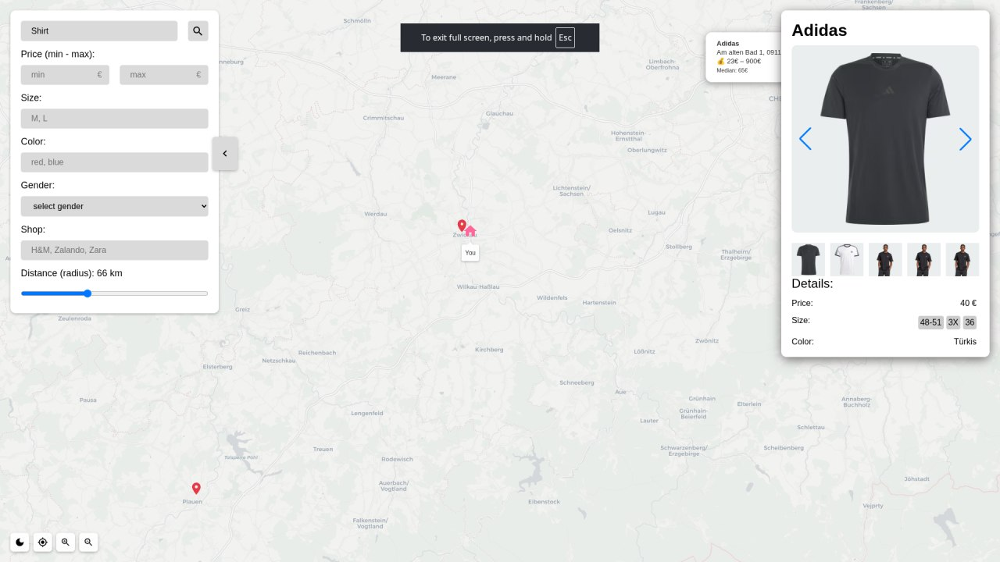
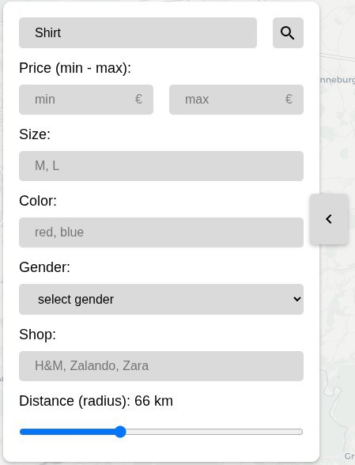
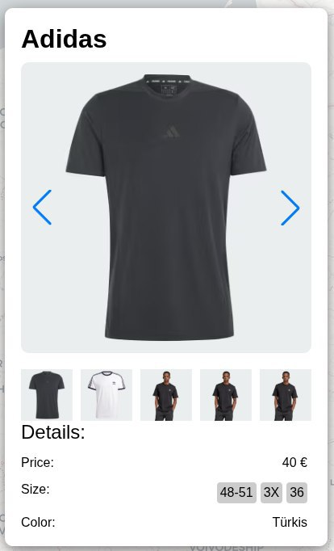
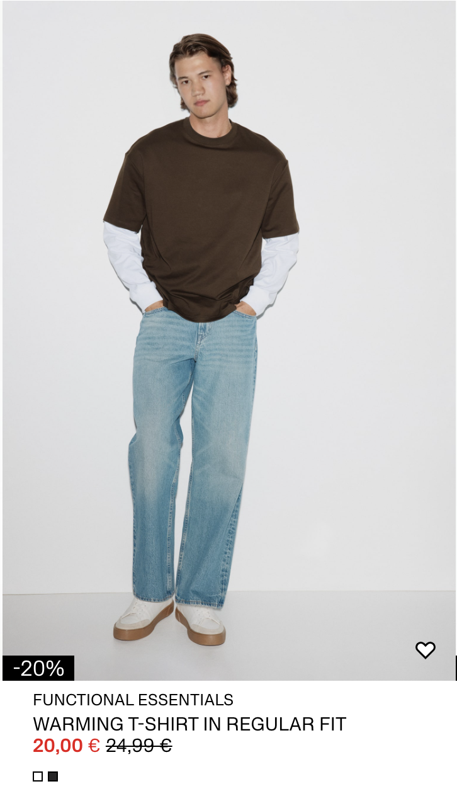
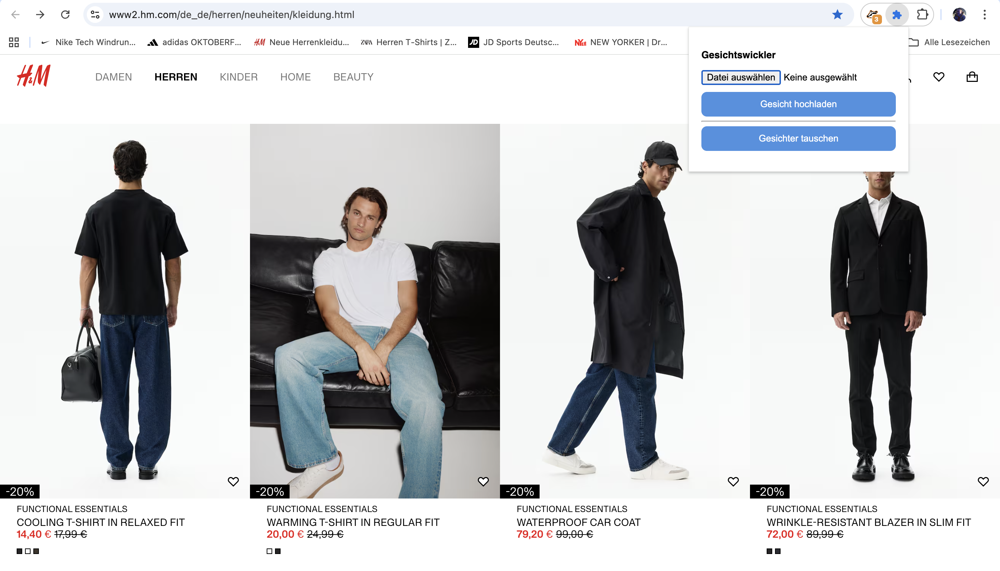
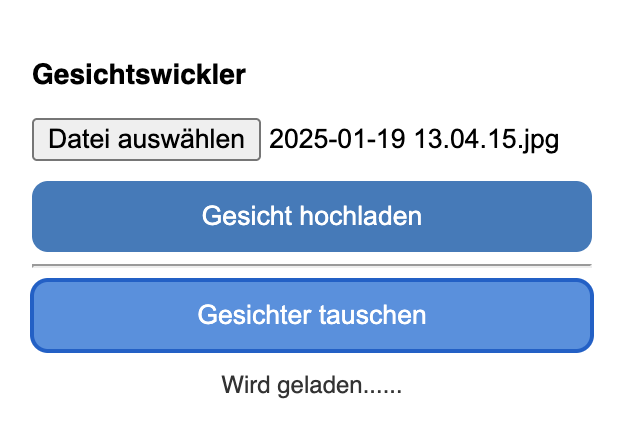
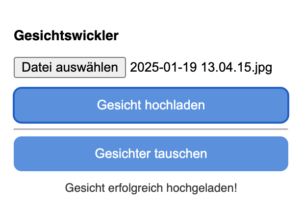
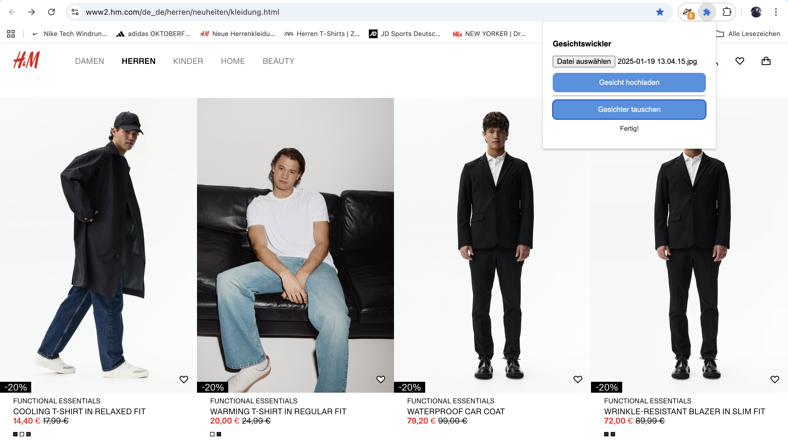

# Benutzerhandbuch: Wie man den besten Preis findet und Kleidung online anprobiert

Dieses Handbuch hilft Ihnen zu verstehen, wie Sie unsere Anwendung nutzen können, um die besten Preise für Produkte zu finden und die einzigartige Möglichkeit der virtuellen Anprobe zu nutzen.

## Einführung

Unsere Anwendung ist ein Preisaggregator, der Ihnen hilft, die besten Angebote für Produkte in verschiedenen Online-Shops zu finden. Aber das ist noch nicht alles! Mit unserer Browser-Erweiterung können Sie Kleidung "anprobieren", indem Sie das Gesicht des Models durch Ihr eigenes ersetzen, um sich besser vorstellen zu können, wie das Produkt an Ihnen aussehen wird.

## Wie es funktioniert: 4 einfache Schritte

### Schritt 1: Produktsuche

Alles beginnt auf der Hauptseite. Geben Sie den Namen des gesuchten Produkts in die Suchleiste ein. Sie können auch Filter verwenden, um Ihre Suche zu verfeinern nach:

*   **Preis:** Geben Sie einen Mindest- und Höchstpreis an.
*   **Kategorie:** Wählen Sie eine Produktkategorie (z. B. "T-Shirts", "Jeans").
*   **Und anderen Parametern.**

### Schritt 2: Preisvergleich

Nachdem Sie Ihre Suchanfrage eingegeben haben, zeigt Ihnen das System alle verfügbaren Optionen an. Sie sehen eine nach Preis sortierte Liste von Produkten, die es Ihnen leicht macht, das beste Angebot zu finden.

### Schritt 3: Zum Shop gehen

Wenn Sie ein Produkt gefunden haben, das Sie interessiert, klicken Sie einfach darauf. Sie werden auf die Produktseite im ursprünglichen Online-Shop weitergeleitet, wo Sie den Kauf tätigen können.

### Schritt 4: Virtuelle Anprobe (FaceWapper)

Das ist der interessanteste Teil! Wenn auf der Produktseite ein Foto eines Models zu sehen ist, können Sie unsere Browser-Erweiterung **FaceWapper** verwenden, um dessen Gesicht durch Ihr eigenes zu ersetzen.

  
  

**Wie es geht:**
1.  [Installieren](#my-point) Sie unsere Browser-Erweiterung für Chrome.
2.  Klicken Sie auf der Produktseite mit dem Model auf das Erweiterungssymbol.
3.  Muessen Sie ein Foto hochladen,dann klicken Sie auf die Schaltfläche "Gesichter tauchen".
4.  Nach einige Sekunden wird das Gesicht des Models auf dem Foto durch Ihr eigenes ersetzt, und Sie können besser beurteilen, ob das Produkt zu Ihnen passt.

## Fazit

Unsere Anwendung macht Online-Shopping nicht nur günstiger, sondern auch persönlicher. Sparen Sie Geld durch Preisvergleiche und haben Sie mehr Spaß beim Einkaufen mit der virtuellen Anprobefunktion.

## <a id="my-point">Projekt-Links</a>

*   **Frontend:** [https://github.com/BreadlyDev/hackathon-aggregator](https://github.com/BreadlyDev/hackathon-aggregator)
*   **Backend:** [https://github.com/tashbaevb/Aggregator_LNDC](https://github.com/tashbaevb/Aggregator_LNDC)
*   **Face Wrapper:** [https://github.com/tashbaevb/FaceWapper](https://github.com/tashbaevb/FaceWapper)
*   **Scraping:** [https://github.com/2pizzzza/ScrapingShops](https://github.com/2pizzzza/ScrapingShops)
